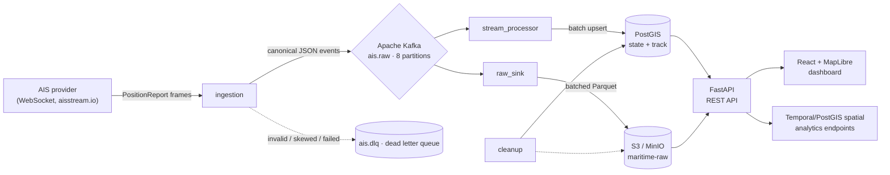

# Maritime Real-Time Tracking Platform

A production-grade, end-to-end **real-time vessel tracking platform** that ingests live AIS (Automatic Identification System) maritime data, brokers it through Kafka, persists it in two tiers (raw object storage + curated PostGIS), and exposes it through a FastAPI service consumed by a React + MapLibre dashboard.

Built as a from-scratch engineering exercise with an explicit focus on **industry-standard practices**: streaming ingestion with backpressure tolerance, idempotent event pipelines, a poison/dead-letter queue strategy, schema canonicalization, timestamp-skew gating, batching with bounded memory, spatial analytics, observability, lifecycle-managed cleanup, containerized infrastructure, and systemd-deployed service units.

**Stack:** Python asyncio · Apache Kafka · PostgreSQL/PostGIS · S3 (MinIO) · Parquet · FastAPI · React · Vite · Docker

**Live demo (AWS EC2, ap-southeast-1):** <http://54.169.181.19> — API docs at <http://54.169.181.19/docs>

---

## Table of Contents

1. [Architecture Overview](#architecture-overview)
2. [End-to-End Data Flow](#end-to-end-data-flow)
3. [Component Deep-Dive](#component-deep-dive)
4. [Key Engineering Decisions & Rationale](#key-engineering-decisions--rationale)
5. [Data Model](#data-model)
6. [Observability](#observability)
7. [Testing](#testing)
8. [Repository Layout](#repository-layout)
9. [Quickstart](#quickstart)
10. [Deployment](#deployment)
11. [Configuration](#configuration)
12. [Roadmap / What's Next](#roadmap--whats-next)

---

## Architecture Overview

The system follows a **lambda-style stream architecture** where the raw event stream is the single source of truth, fanned out into two independent consumers — one for the raw restorable archive, one for curated real-time state/track analytics.



Key design properties:

- **Kafka as the durable backbone** — producers and consumers are fully decoupled; the ingestion service can burst, pause, or restart without losing or overloading downstream systems.
- **Two materialized stores** — raw immutable Parquet archive (replay/audit/data-quality) plus high-performance PostGIS state/track (live dashboard).
- **At-least-once delivery with idempotency** — record-level `UNIQUE(mmsi, event_id)` in PostGIS and partition-aligned consumption allow safe reprocessing after a crash.
- **Dead-letter queue at every hop** — validation failures, timestamp-skewed events, and un-parseable "poison" events are quarantined instead of silently dropped or repeatedly retried.
- **Resilience to infrastructure churn** — consumers survive broker restarts, shun Kafka's availability via reconnect + exponential backoff, and DB batches retry with circuit-breaker semantics.

---

## End-to-End Data Flow

1. **Ingestion** opens a WebSocket connection to a live AIS provider, receives `PositionReport` frames, validates each against a canonical schema, normalizes to a versioned internal event model (18 fields, `schema_version`), and publishes to Kafka topic `ais.raw` (8 partitions).
2. **Ingestion-side quality gates** run **before** publication: non-position messages are skipped; schema-invalid events go to `ais.dlq` with `validation_failed`; events whose `event_time` is outside the skew tolerance window (future > 60 s or stale > 6 h) go to `ais.dlq` with `future_skew` / `stale_skew`. A skew gate keeps out-of-order garbage out of the archive and analytics.
3. **raw_sink** consumes `ais.raw` as a Kafka consumer group, buffers events in main memory (row- and age-triggered flush), and writes **batched Parquet files** to S3 (`s3://maritime-raw/raw/dt=YYYY-MM-DD/HH=<hour>/...`). Parquet + columnar layout provides compactness and enables later analytics on the raw tier.
4. **stream_processor** consumes `ais.raw` in an independent consumer group, derives a vessel **status** (`MOVING`, `IDLE`, `ANCHORED`, `MOORED`, `STALE`, `OFFLINE`), upserts the latest state into `vessel_current_state`, and appends every event to `vessel_track` — with spatial points stored as **PostGIS `GEOGRAPHY(Point, 4326)`** for accurate geodesic distance queries.
5. **cleanup** runs periodic jobs: deletes track rows older than retention (e.g. 24 h), marks vessels `STALE` after they stop reporting, optionally purges stale state, and maintains an S3 lifecycle rule to expire raw objects (`S3_RETENTION_DAYS`).
6. **FastAPI** serves the live state, vessel tracks, and derived intelligence (speed/navigation/flow/maneuvering distributions, data-quality percentiles, spatial near & conflict detection) backed by spatial-indexed SQL.
7. **React + MapLibre** dashboard renders the live fleet on a globe/map, per-vessel speed/heading details, and intelligence charts from the API.

---

## Component Deep-Dive

### `ingestion` — schema-canonicalizing ingress

- Async WebSocket consumer with exponential-backoff reconnect (jittered) so a provider blip never kills the process.
- Pipeline per event: **validate** → **normalize** → **skew gate** → **publish**. Every failure path has an explicit outcome (skip, DLQ, publish).
- `ingestion/normalizer.py` emits a canonical event model with `schema_version`, UTC-aware `event_time`, `ingested_at` (arrival clock), measured `latency_ms`, and raw-circumference fields (SOG, COG, heading, ROT, nav status).
- `ingestion/validator.py` implements a hard **timestamp skew gate** (`INGEST_FUTURE_SKEW_TOLERANCE_SECONDS=60`, `INGEST_STALE_SKEW_TOLERANCE_SECONDS=21600`) treating device clock drift as a data-quality problem, not an application one.
- Ships with graceful SIGINT/SIGTERM handling (cancels tasks, flushes producers) and a 10 s publish deadline with DLQ fallback on broker failure.

### `raw_sink` — batched columnar archive

- Consumes with **manual offset commits after successful flush** (at-least-once). A crash between commit points is recovered by replay, which is idempotent at the storage layer.
- `raw_sink/buffer.py` :: bounded in-memory `BatchBuffer` flush triggers: `PARQUET_MAX_ROWS=1000`, `PARQUET_MAX_SECONDS=900`, `PARQUET_MIN_ROWS=100` — never builds unbounded memory, never fragments into trivial files.
- `parquet_writer.py` writes partitioned Arrow tables with UTC-norm timestamp columns; `s3_storage.py` uploads with streaming `/tmp` spill then multipart-safe PUT.
- **Circuit breaker**: when a flush cannot succeed (broker gone or S3 down), consumption is paused with exponential backoff up to a cap instead of hot-lopping, protecting both Kafka and object storage.
- **Poison isolation**: a batch that repeatedly fails to serialize is decomposed event-by-event; the offending records are moved to `ais.dlq` with `row_build_failed` while healthy records proceed.
- Survives broker restarts: `KafkaConnectionError` during poll or commit triggers consumer recreation + rejoin (verified by restarting the broker under load).

### `stream_processor` — real-time materialization

- Independent consumer group keeps state/track writes isolated from archive writes.
- Per-batch transaction: `vessel_track` insert uses `ON CONFLICT (mmsi, event_id) DO NOTHING` (idempotent), state upsert uses `ON CONFLICT (mmsi) DO UPDATE` — the current state table is a **true latest-state projection**.
- Buffers up to `STATE_FLUSH_ROWS=500` or `STATE_FLUSH_SECONDS=5`; failed batches are retried (events retained in memory) with poison-event isolation after `MAX_RETAIN_RETRIES=3`.
- `stream_processor/status.py` derives operational status used by dashboard filters and the API.
- Ensures PostGIS schema idempotently at boot (`db.ensure_schema`), so a fresh instance self-heals its schema.

### `cleanup` — lifecycle management

- Runs on a ticker (`CLEANUP_INTERVAL_SECONDS=300`), also supports `--once` / `--dry-run` for operators.
- Track retention (24 h), STALE marking (45 min of silence), optional stale purge, and **S3 lifecycle rule** application (`S3_LIFECYCLE_ON`) so object expiry is enforced server-side by the bucket owner, not a cron.

### `api` — spatial intelligence service

- FastAPI + Pydantic response models; PostGIS-powered endpoints:
  - `/health` · `/vessels` (+ nearby / detail / track)
  - `/intelligence/summary` — fleet KPIs (fresh/stale/moving/idle/anchored/moored, avg/max SOG, fastest vessel, status breakdown)
  - `/intelligence/speed` — SOG histogram + p50/max statistics
  - `/intelligence/navigation` — NAV status distribution
  - `/intelligence/flow` — COG sector rose (16 points) with mean SOG
  - `/intelligence/maneuvering` — vessels ranked by |ROT| with decoded deg/min + direction
  - `/intelligence/data-quality` — latency percentiles & completeness vs the raw archive
  - `/intelligence/conflicts` — proximity pairs within a radius using GiST-indexed geodesic distance
- **CORS is configurable** (`CORS_ORIGINS`) — unknown origins are rejected, unlike a permissive `*`.
- Read-only design (no write endpoints) keeps the API surface minimal and safe.

### `frontend` — React 19 + Vite + MapLibre

- Fleet map engine (MapLibre GL) with live vessel markers, per-vessel detail panel (heading/SOG/status track), and an Intelligence tab rendering the API's distribution endpoints as charts.
- Vite dev server with EMPTY oxlint findings (`0 warnings, 0 errors`) and reproducible production builds.

---

## Key Engineering Decisions & Rationale

| Decision | Choice | Rationale |
|---|---|---|
| Message backbone | **Apache Kafka** (cp-kafka 7.5, 1 broker) | Decouples producers from consumers, gives durable replay + independent consumer groups, offsets as the resume mechanism. Single-broker is appropriate for the dev footprint in docker-compose while preserving production semantics (enough; replication is a knob change, not an architecture change). |
| Ingestion transport | **asyncio + websockets** | AIS streams are high-rate, connection-oriented; async WebSocket with jittered exponential backoff maximizes uptime with minimal resource use. |
| Raw archive format | **Parquet on S3 (MinIO)** | Columnar + compressed files beat JSONL for storage cost and future batch analytics; partition prefixes (`dt/HH`) make expiry/scanning O(1) per hour. |
| Analytics store | **PostgreSQL + PostGIS** | State is a point-in-time projection (natural fit for a relational upsert); `GEOGRAPHY(Point,4326)` + GiST indexes make radius & proximity queries correct and fast. |
| Dual write paths | **raw_sink (S3) + stream_processor (PostGIS)** | Separation of concerns: archive tier optimizes for cost/replay; serving tier optimizes for low-latency reads. Each consumer group is independently rate-bounded. |
| Delivery guarantee | **At-least-once + idempotency** | Exactly-once adds heavyweight transactional overhead at Kafka; at-least-once with `UNIQUE(mmsi,event_id)`, `ON CONFLICT DO NOTHING`, and manual-offset commits after flush gives effectively-idempotent pipelines in practice. |
| Failure handling | **DLQ at every hop + circuit breaker** | Silent drops hide data loss; infinite retries cause backlogs. DLQ quarantines (validation, skew, poison, publish-fail) — the operational truth is observable and re-injectable. |
| Time correctness | **UTC-aware parse + skew gate** | Device clock drift pollutes timelines; events outside ± tolerance are quarantined instead of distorting latency percentiles and tracks. |
| API contract | **Pydantic response models + read-only** | Static typing on the wire, self-documenting `/docs`, no mutation surface to abuse. |
| Config | **12-factor `.env`** | All knobs via environment (single source), `.env.example` committed, secrets `.gitignore`d; `CORS_ORIGINS` shipped configurable rather than `*`. |
| Process supervision | **systemd units + `Restart=always`** | Containerized infra (docker-compose) + host-level services (systemd) is the pragmatic best-practice split for stream workers; survives reboots, crashes, OOMs. |
| Observability | **Structured JSON logs** | Every component emits `{event, ...fields}` — greppable/machine-readable, metric fields (latency_ms, counts) directly usable. |
| Testing | **Unit (52) + integration (3) suite** | `pytest` markers separate fast unit tests from live-infra integration tests (`-m "not integration"` default). |

---

## Data Model

`stream_processor/db.py` and `db/schema.sql` are the single source of truth (idempotent, applied at boot).

**`vessel_current_state`** — one row per vessel, upserted on every event (latest projection):

```sql
mmsi        TEXT PRIMARY KEY           -- 9-digit vessel id
ship_name   TEXT
latitude / longitude  DOUBLE PRECISION -- display coords
sog_knots, cog_degrees, true_heading, rate_of_turn  DOUBLE PRECISION
nav_status  INTEGER
position    GEOGRAPHY(Point, 4326)      -- GiST-indexed spatial point
status      TEXT                        -- MOVING/IDLE/ANCHORED/MOORED/STALE/OFFLINE
last_seen_at / updated_at  TIMESTAMPTZ
```

**`vessel_track`** — historical positions, deduplicated at the record level:

```sql
id           BIGSERIAL PRIMARY KEY
mmsi         TEXT NOT NULL
event_id     TEXT NOT NULL              -- dedup key (mmsi, event_id)
latitude / longitude  DOUBLE PRECISION
sog_knots    DOUBLE PRECISION
event_time   TIMESTAMPTZ                -- UTC-aware source time
position     GEOGRAPHY(Point, 4326)     -- two-sided (index covers mmsi+time, GiST covers position)
partition_hour TIMESTAMP                -- hour partitioning for retention
UNIQUE (mmsi, event_id)
```

---

## Observability

- **Structured logs** — all services emit JSON records (`{"event": "postgis batch committed", "state_rows": 55, ...}`), WARN/ERROR paths carry the reason and offending id.
- **Data-quality endpoint** — the API computes latency percentiles and volume over a sliding window so the operator can watch p50/p95 drift in real time.
- **Health & lifetime** — Per-service healthchecks in docker-compose (`pg_isready`, Kafka topic list, MinIO `/minio/health/live`, ZK `srvr`), startup schema self-heal, and graceful shutdown signal handling in ingestion.

---

## Testing

- **52 unit tests** — validator/skew gate, normalizer, status derivation, parquet batch buffer, DLQ helper, data-quality math, stream row building.
- **3 integration tests** — live Kafka connectivity, PostGIS insert/read round-trip, S3 head/put/list (marked `integration`, skipped by default).
- **Frontend** — oxlint `0 warnings / 0 errors`; `vite build` deterministic.
- Run: `venv/bin/python -m pytest` (unit) and `venv/bin/python -m pytest -m integration` (with infra up).

---

## Repository Layout

```
├── ingestion/          # asyncio WebSocket consumer, validator, normalizer, Kafka producer
├── stream_processor/   # PostGIS materializer (state upsert + track insert), poison isolation
├── raw_sink/           # Kafka -> Parquet -> S3, batch buffer, circuit breaker
├── cleanup/            # retention, STALE marking, S3 lifecycle
├── api/                # FastAPI; spatial/intelligence endpoints, data-quality
├── frontend/           # React 19 + Vite + MapLibre dashboard
├── common/             # shared DLQ helper
├── db/                 # idempotent PostGIS schema (reference)
├── docker/             # docker-compose: Zookeeper, Kafka, MinIO, PostGIS
├── deploy/             # systemd units + idempotent installer script
├── scripts/            # run_pipeline.sh (idempotent process launcher)
└── tests/              # unit + integration suites
```

---

## Quickstart

Prerequisites: Docker, Python 3.11, Node.js 20+.

```bash
# 1. Infrastructure (Zookeeper, Kafka, MinIO, PostGIS)
docker compose -f docker/docker-compose.yml up -d

# 2. Environment
cp .env.example .env         # then put your real AisStream API key in .env

# 3. Python deps + boot the pipeline
python3 -m venv venv && venv/bin/pip install -r requirements.txt
./scripts/run_pipeline.sh    # starts ingestion, stream_processor, raw_sink, cleanup

# 4. API
venv/bin/uvicorn api.main:app --host 0.0.0.0 --port 8000

# 5. Frontend
cd frontend && npm install && npm run dev    # http://localhost:5173
```

Verify: `curl localhost:8000/health` → `{"status":"ok","database":"ok"}`, then watch `http://localhost:5173` for live vessels.

Topics `ais.raw` and `ais.dlq` are created automatically with `KAFKA_PARTITIONS=8`; all PostgreSQL/S3 layers are self-healing (schema/bucket ensured at startup).

---

## Deployment

Three layers — containerized stateful infrastructure, nginx as the public entry, and host-managed stateless workers:

| Layer | Mechanism | Notes |
|---|---|---|
| Infra (ZK, Kafka, MinIO, PostGIS) | `docker compose` | healthchecks + `restart: unless-stopped`; pinned image tags (e.g. `minio/minio:RELEASE.2025-09-07T16-13-09Z`) for reproducible deploys |
| Public HTTP | **nginx** (`deploy/nginx.conf`) | serves the built SPA, proxies `/api` → uvicorn on loopback, immutable-caches hashed assets, single-origin (no CORS at runtime) |
| Workers (ingestion, raw_sink, stream_processor, cleanup, api) | systemd units | `Restart=always`, `EnvironmentFile=<root>/.env.systemd`, API bound to `127.0.0.1` (only nginx reaches it) |

```bash
# 1. Build the production frontend (same-origin /api)
./deploy/build-frontend.sh

# 2. Install systemd units + nginx site (idempotent; run as root on the host)
sudo ./deploy/install-systemd.sh
systemctl enable --now maritime-ingestion maritime-stream-processor maritime-raw-sink maritime-cleanup maritime-api
```

The installer normalizes `.env` → `.env.systemd` (systemd pulls exact `KEY=VALUE` pairs), substitutes `<ROOT>` with the absolute project path in every unit and the nginx site, and reloads nginx after `nginx -t`. Deploy from a **space-free path** (e.g. `/opt/maritim-tracking`): a quoted nginx `root` combined with `try_files` triggers a redirection cycle, so paths are taken literally. `.env` and `.env.systemd` are gitignored; secrets never leave the host.

---

## Configuration

All knobs via environment (see `.env.example`): stream geometries (`AISSTREAM_BOUNDING_BOXES`), topics/partitions, skew tolerances, flush thresholds, retention windows, S3/MinIO credentials, API host/port, and `CORS_ORIGINS`. Permissive defaults are avoided; secrets are never committed.

---

## Roadmap / What's Next

- Multi-broker Kafka (replication factor 3) for cluster-grade durability.
- Manual reprocess job that replays `ais.dlq` back into `ais.raw` (operational tooling).
- Longer track retention via TimescaleDB hypertables if 24 h window must grow.
- AuthN/Z on the API (API-key or OIDC) for multi-tenant exposure.